# Configuración de OAuth2 y Almacenamiento en la Nube

Este documento explica cómo configurar la autenticación OAuth2 con Google, Facebook y GitHub, así como el almacenamiento en Google Drive y OneDrive.

## 📋 Requisitos Previos

1. Python con todas las dependencias instaladas
2. Node.js para el frontend
3. Cuentas en los proveedores que desees usar

## 🔑 Configuración de OAuth2

### 1. Google OAuth

#### Crear Aplicación en Google Cloud Console

1. Ve a [Google Cloud Console](https://console.cloud.google.com/)
2. Crea un nuevo proyecto o selecciona uno existente
3. Ve a **APIs & Services** > **Credentials**
4. Haz clic en **Create Credentials** > **OAuth 2.0 Client ID**
5. Configura la pantalla de consentimiento si es necesario
6. Tipo de aplicación: **Web application**
7. **Authorized redirect URIs**:
   ```
   http://localhost:8000/api/v1/auth/callback/google
   ```
8. Copia el **Client ID** y **Client Secret**

#### Habilitar APIs Necesarias

1. Ve a **APIs & Services** > **Library**
2. Busca y habilita:
   - Google+ API
   - Google Drive API (para almacenamiento)
   - Google People API

### 2. GitHub OAuth

1. Ve a [GitHub Settings](https://github.com/settings/developers)
2. **OAuth Apps** > **New OAuth App**
3. Completa el formulario:
   - **Application name**: YOLO11 App
   - **Homepage URL**: `http://localhost:3000`
   - **Authorization callback URL**: `http://localhost:8000/api/v1/auth/callback/github`
4. Copia el **Client ID** y **Client Secret**

### 3. Facebook OAuth

1. Ve a [Facebook for Developers](https://developers.facebook.com/)
2. **My Apps** > **Create App**
3. Selecciona **Consumer** como tipo de app
4. Completa los detalles de la aplicación
5. Ve a **Settings** > **Basic**
6. Copia **App ID** y **App Secret**
7. Agrega **Facebook Login** como producto
8. En **Facebook Login** > **Settings**:
   - **Valid OAuth Redirect URIs**: `http://localhost:8000/api/v1/auth/callback/facebook`

## ⚙️ Configuración del Backend

### Archivo `.env`

Crea un archivo `.env` en `backend/` con las siguientes variables:

```env
# Security
SECRET_KEY=tu-clave-secreta-super-segura-cambia-esto

# Google OAuth
GOOGLE_CLIENT_ID=tu-google-client-id.apps.googleusercontent.com
GOOGLE_CLIENT_SECRET=tu-google-client-secret

# GitHub OAuth
GITHUB_CLIENT_ID=tu-github-client-id
GITHUB_CLIENT_SECRET=tu-github-client-secret

# Facebook OAuth  
FACEBOOK_CLIENT_ID=tu-facebook-app-id
FACEBOOK_CLIENT_SECRET=tu-facebook-app-secret
```

### Instalar Dependencias

```bash
cd backend
pip install -r requirements.txt
```

## 🚀 Iniciar la Aplicación

### Backend

```bash
cd backend
source venv/bin/activate  # En Windows: .\venv\Scripts\Activate.ps1
uvicorn app.main:app --reload --host 0.0.0.0 --port 8000
```

### Frontend

```bash
cd frontend
npm install
npm run dev
```

## 💾 Configuración de Almacenamiento en la Nube

### Google Drive

1. **Inicia sesión** en la aplicación
2. Ve a **Configuración** > **Almacenamiento**
3. Selecciona **Google Drive**
4. Haz clic en **Conectar Google Drive**
5. Autoriza la aplicación en la ventana emergente
6. Haz clic en **Guardar Configuración**

**Permisos necesarios:**
- Ver y administrar archivos de Google Drive
- Ver información básica del perfil

### Microsoft OneDrive

1. **Inicia sesión** en la aplicación
2. Ve a **Configuración** > **Almacenamiento**
3. Selecciona **Microsoft OneDrive**
4. Haz clic en **Conectar OneDrive**
5. Autoriza la aplicación
6. Haz clic en **Guardar Configuración**

**Permisos necesarios:**
- Acceso completo a archivos del usuario
- Acceso sin conexión

## 📁 Estructura de Almacenamiento

### Local (Por Defecto)

```
backend/
  datasets/
    nombre_dataset/
      images/
        train/
        val/
        test/
      labels/
        train/
        val/
        test/
      data.yaml
```

### Google Drive / OneDrive

Se replica la misma estructura en tu carpeta raíz:

```
Mi Drive/ (o OneDrive/)
  YOLO11/
    datasets/
      nombre_dataset/
        ...
```

## 🧪 Probar la Configuración

### Probar OAuth

```bash
# Inicia sesión en la aplicación web
# Verifica que puedas ver tu nombre y avatar en Configuración > Cuenta
```

### Probar Almacenamiento

```bash
# En Configuración > Almacenamiento
# Haz clic en "Probar Conexión"
# Debe mostrar "Conexión exitosa" con el número de archivos
```

## 🔒 Seguridad en Producción

### Cambios Necesarios para Producción:

1. **Generar SECRET_KEY seguro**:
   ```python
   import secrets
   print(secrets.token_hex(32))
   ```

2. **Actualizar URLs de redirección** en las consolas de OAuth:
   ```
   https://tu-dominio.com/api/v1/auth/callback/google
   https://tu-dominio.com/api/v1/auth/callback/github
   https://tu-dominio.com/api/v1/auth/callback/facebook
   ```

3. **Actualizar CORS** en `backend/app/main.py`:
   ```python
   allow_origins=["https://tu-dominio.com"]
   ```

4. **Usar HTTPS** siempre en producción

5. **Base de datos real** en lugar de almacenamiento en memoria:
   - SQLite para desarrollo
   - PostgreSQL para producción

6. **Variables de entorno** en el servidor (no subir `.env`)

## 🐛 Troubleshooting

### Error: "redirect_uri_mismatch"
- Verifica que la URL de callback coincida exactamente con la configurada en la consola de OAuth
- Incluye el protocolo (`http://` o `https://`)
- No incluyas barras finales

### Error: "Invalid client"
- Verifica que el Client ID y Client Secret sean correctos
- Verifica que no tengan espacios al inicio o final
- Regenera las credenciales si es necesario

### Error: "Access denied"
- Verifica que la aplicación esté en modo público (no sandbox)
- Para Facebook: verifica que el usuario de prueba esté autorizado

### Error de almacenamiento: "Connection failed"
- Verifica que las APIs estén habilitadas (Google Drive API, etc.)
- Verifica que los permisos OAuth incluyan acceso a archivos
- Refresca el token OAuth desconectando y volviendo a conectar

## 📚 Recursos Adicionales

- [Google OAuth Documentation](https://developers.google.com/identity/protocols/oauth2)
- [GitHub OAuth Documentation](https://docs.github.com/en/developers/apps/building-oauth-apps)
- [Facebook Login Documentation](https://developers.facebook.com/docs/facebook-login)
- [Google Drive API](https://developers.google.com/drive/api/guides/about-sdk)
- [Microsoft Graph API](https://docs.microsoft.com/en-us/graph/api/overview)

## 🎯 Flujo de Autenticación

```mermaid
sequenceDiagram
    Usuario->>Frontend: Click "Login con Google"
    Frontend->>Backend: GET /api/v1/auth/login/google
    Backend->>Google: Redirige a OAuth
    Google->>Usuario: Pantalla de autorización
    Usuario->>Google: Autoriza
    Google->>Backend: Callback con código
    Backend->>Google: Intercambia código por token
    Google->>Backend: Token + Info usuario
    Backend->>Backend: Crea JWT token
    Backend->>Frontend: Redirige con token
    Frontend->>Frontend: Guarda token
    Frontend->>Usuario: Dashboard
```



## ✅ Checklist de Configuración

- [ ] Crear aplicaciones OAuth en consolas de proveedores
- [ ] Configurar URLs de redirección
- [ ] Copiar Client IDs y Secrets al archivo `.env`
- [ ] Habilitar APIs necesarias (Google Drive, etc.)
- [ ] Instalar dependencias del backend
- [ ] Instalar dependencias del frontend
- [ ] Probar login con cada proveedor
- [ ] Probar configuración de almacenamiento
- [ ] Verificar que se pueden listar archivos
- [ ] Probar subida y descarga de archivos
